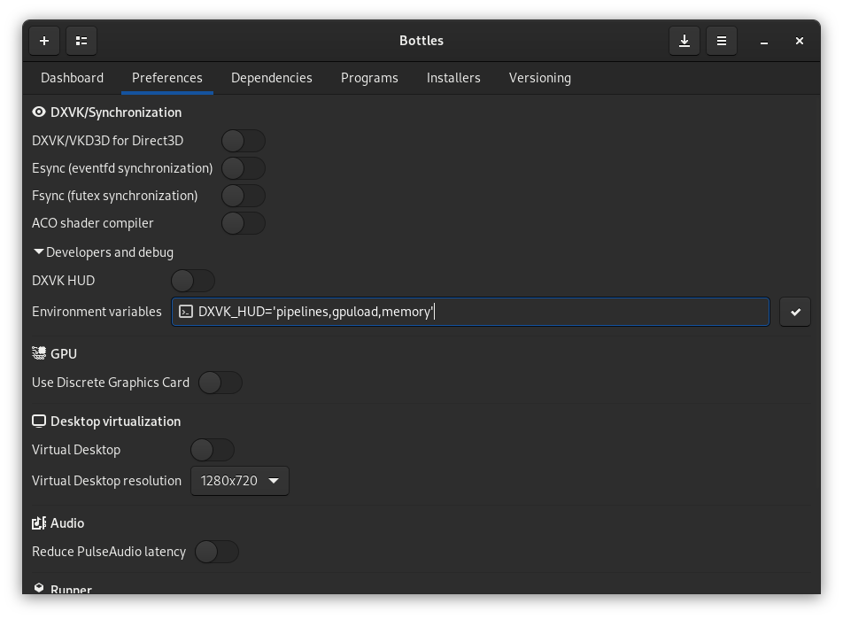

# DXVK

This magical component takes care of translating instructions from Direct3D 9/10/11 \(from Windows\) to Vulkan \(to Linux\) and is developed by [doitsujin](https://github.com/doitsujin/dxvk) and many other contributors.

Mainly dxvk is a .dll override bundle which, integrated in a wine prefix, allows you to detect and translate calls from DirectX to Vulkan. This is done automatically, without any user intervention.

## How to enable

Basic DXVK is installed and enabled by Bottles when creating a bottle in the following environments:

* Gaming environment
* Software environment

You can check its activation from the bottle preferences, checking the "DXVK for Direct3D" voice.

When this component is enabled, a backup of the old dlls is created in the wineprefix and automatically recovered when disabled.

## DXVK updates

You can keep this component updated from Bottles preferences.


## Environment variables

DXVK came with a large number of environment variables to better configure it.


If you don't know what we're talking about, don't touch anything. Bottles preconfigure those that are essential for correct operation.


* `DXVK_STATE_CACHE_PATH` is preconfigured and points to the root path of the bottle
* `DXVK` is preconfigured to `compiler` otherwise is set to `devinfo, memory, drawcalls, fps, version, api, compiler` if enabled from the settings for Developers and Debug in the bottle

Other variables can be found from the [official repository](https://github.com/doitsujin/dxvk/#hud) and can be set using the Environment Variables field in the bottle preferences, like this:

```text
DXVK_HUD='pipelines,gpuload,memory' DXVK_STATE_CACHE=0
```



