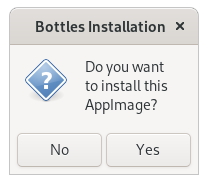

# Installation

## Using the AppImage

First you need to download the latest release from our [website](https://usebottles.com/download) then, set executable permission to the `.AppImage` file:

```text
chmod +x Bottles-*-x86_64.AppImage
```

Move the file to a safe path where there is no risk of deleting them and double click on it, or launch via the terminal by typing:

```bash
./Bottles-*-x86_64.AppImage
```

#### Install the Appimage

At the first launch, Bottles asks you if you want to install the AppImage, this will make it available in the applications menu of the Desktop Environment in use:



### Flatpak

#### Flathub

You can find bottles on the [official Flathub page](https://flathub.org/apps/details/com.usebottles.bottles)

Ensure the flathub repository is active:

You can install bottles with a simple command:

```bash
flatpak install flathub com.usebottles.bottles
```

After this you can find the bottles icon in your menu or in your applications.

```bash
flatpak remote-add --if-not-exists flathub https://flathub.org/repo/flathub.flatpakrepo
```

Then install Bottles with:

```bash
flatpak install com.usebottles.bottles
```

Or, if your package manager supports flathub links, [click here](https://dl.flathub.org/repo/appstream/com.usebottles.bottles.flatpakref).

#### Manual build flatpak

We need the following dependencies:

* org.gnome.Sdk
* org.gnome.Sdk.Compat.i386
* org.freedesktop.Sdk.Extension.toolchain-i386

Download the latest bottles source from GitHub:

```bash
wgen -O bottles-source.zip https://github.com/bottlesdevs/Bottles/archive/master.zip
unzip bottles-source.zip
cd bottles-source
```

Build can be performed using `flatpak-builder` \(installable using your distribution package manager like apt, dnf, ..\):

```bash
flatpak-builder --repo=bottles --force-clean --user build-dir com.usebottles.bottles.yml
flatpak remote-add --user bottles bottles --no-gpg-verify
flatpak install --user bottles com.usebottles.bottles
```

Then run using `flatpak` command:

```bash
flatpak run com.usebottles.bottles
```

### Unofficial packages

Our community provides non-official packages for installing Bottles on some distributions.

#### Arch Linux

There are two packages from AUR for Arch Linux:

* [bottles-git](https://aur.archlinux.org/packages/bottles-git) \(which offers the latest version from our git repository\)
* [bottles](https://aur.archlinux.org/packages/bottles) \(which should be the latest stable version\)

To install one of these packages use an AUR helper like `yay` or `paru`:

```bash
yay -S bottles-git
```

or manually using `makepkg`:

```bash
git clone https://aur.archlinux.org/packages/bottles-git
cd bottles-git
makepkg -si
```

#### Fedora & Open suse \(Tumbleweed\)

The latest `rpm` package ca be found in [this](https://download.opensuse.org/repositories/home:/WhiXard/openSUSE_Tumbleweed/x86_64/) repository and can be installed double clicking on it \(in most distributions\) or by terminal using the `rpm` command:

```bash
$ rpm -i package_name.rpm
```

### Build from source

You can also build Bottles from source.

Requirements:

* meson
* ninja
* python3
* glib
  * `glib2-devel` on Fedora
  * `libglib2.0-dev` on Debian/Ubuntu

Clone Bottles from GitHub:

```bash
git clone https://github.com/bottlesdevs/Bottles.git
cd Bottles
```

and build using `meson` and install using `ninja`:

```bash
mkdir build
meson build && cd build
ninja -j$(nproc)
$ ninja install
```

